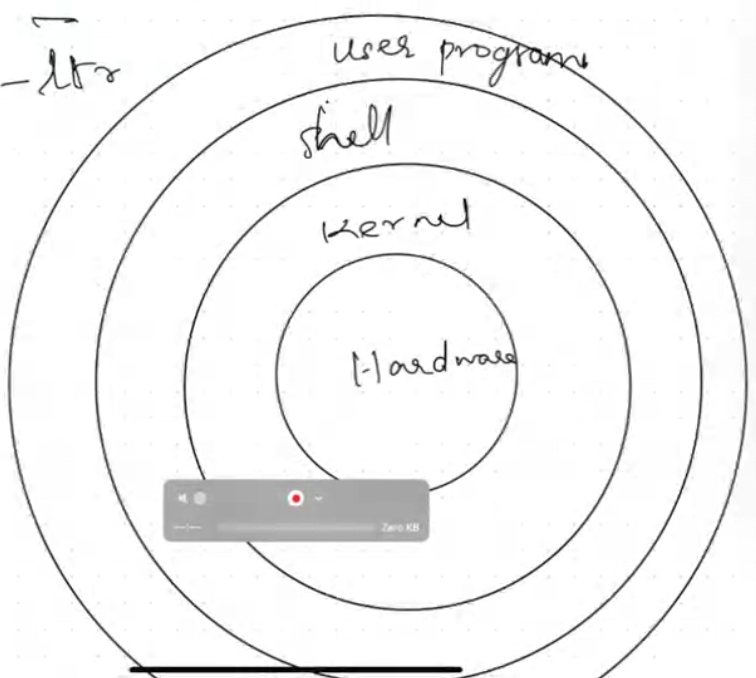

# Linux

## Shell Scripting 

Shell scripting is used to automate tasks in Linux/UNIX systems using the shell (command-line interpreter). It helps save time by running commands automatically instead of typing them again and again.

Creating a shell script:
- Create a file with `.sh` extension (example: script.sh)
- Add this at the top to specify the shell:
  #!/bin/bash
- Write normal Linux commands inside the file

Running a shell script:
- Make it executable using:
  chmod +x script.sh
- Run it using:
  ./script.sh

Variables and input:
- Create a variable:
  VAR=value
- Use a variable:
  $VAR
- Take user input:
  read -p "Enter value: " VAR

Conditionals:
- Used to make decisions in scripts
- Example structure:
  if [ condition ]; then
    commands
  fi
- Check if file exists:
  -f filename

Loops:
- Used to repeat tasks
- For loop example:
  for i in 1 2 3; do
    echo $i
  done
- While loop example:
  while [ condition ]; do
    commands
  done

File and directory management:
- Create directory: mkdir
- Move into directory: cd
- Create file: touch, cat > file
- Common commands: ls, pwd, cp, mv, rm
- rm -rf deletes files and folders permanently (use carefully)

File permissions:
- r = read, w = write, x = execute
- Change permissions using:
  chmod
- ACLs allow more detailed permission control than chmod

String and text processing:
- Common tools: tr, sed, awk
- Convert string to uppercase:
  echo $STR | tr [a-z] [A-Z]

Find command:
- Used to search files:
  find path -name pattern

Functions:
- Used to reuse code
- Define function:
  my_function() {
    commands
  }
- Call function:
  my_function

User and group management:
- Create user: useradd
- Create group: groupadd
- Used for automating user, group, and permission setup

